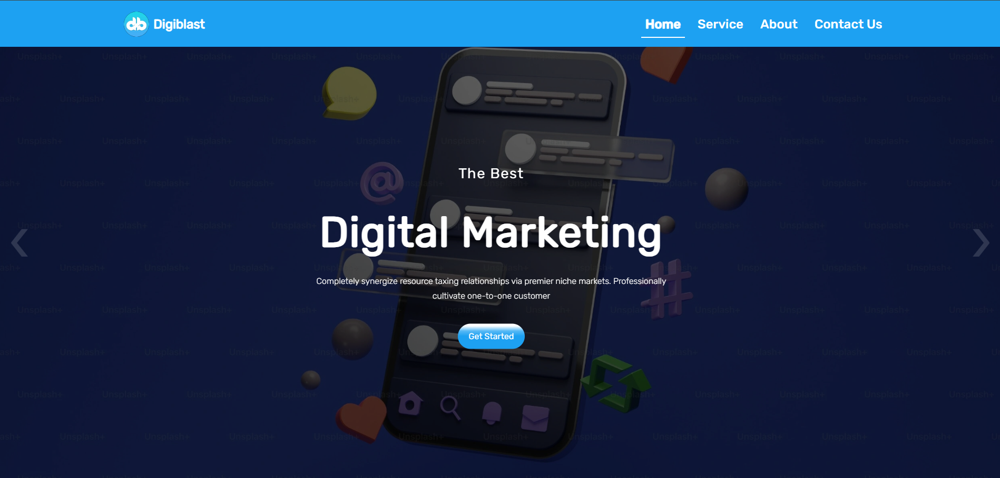
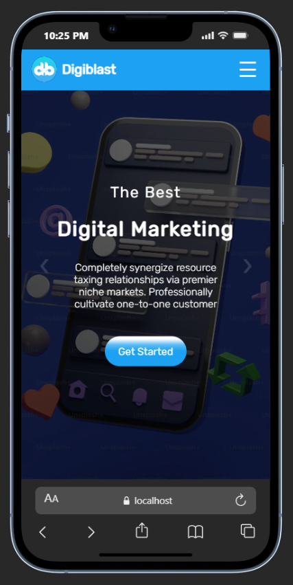

# Digiblast - Digital Solutions Platform

Digiblast is a modern web application designed to showcase digital services and provide a streamlined interface for business interactions. Developed during my 6-month Web Development Internship, this project focuses on high performance, clean UI, and efficient frontend-backend communication.

## Key Features
* **Modern Business Interface:** A professional layout tailored for digital agencies or technology service providers.
* **Responsive Architecture:** Fully compatible across all screen sizes (Mobile, Tablet, and Desktop).
* **Service Showcase:** Dynamic sections to highlight key service offerings and company expertise.
* **Lead Generation:** Optimized contact forms and call-to-action buttons to convert visitors into clients.
* **Clean Codebase:** Structured using best practices for maintainability and scalability.

## Technologies Used
* **Frontend:** HTML5, CSS3 (Custom Styling), JavaScript
* **Backend:** PHP
* **Performance:** Optimized assets and minimal script overhead for fast loading.

## Project Structure
* `Home/` - Core landing page with service highlights.
* `Services/` - Detailed breakdown of business offerings.
* `Assets/` - Organized folder for images, icons, and UI components.
* `Contact/` - Lead capture and communication module.

## Project Preview

---
**Developed by:** Isuru Shehan 
